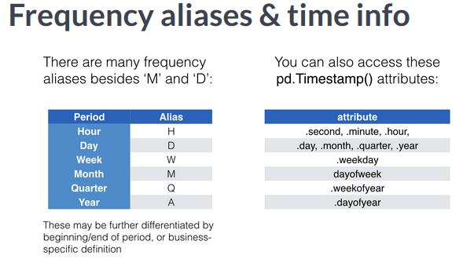

### Manipulating time series data

#### Basic building block : pd.Timestamp

```python
import pandas as pd
from datetime import datetime
time_stamp = pd.Timestamp(datetime(2017, 1 ,1))
pd.Timestamp('2017-01-01') == time_stamp

time_stamp.year
time_stamp.weekday_name
```

#### More building blocks : pd.Period & freq
- pandas also has a data type for time periods.The period object always has a frequency, with months as the default.
- It also has a method to convert between frequencies, for instance from monthly to daily frequencies. Period object has freq attribute to store frequency info
- We can a period to a timestamp object, and a timestamp back to a period object.

```python
period = pd.Period('2017-02')
period # default : month-end

period.asfreq('D') # convert to daily

period.to_timestamp().to_period('M')
```

#### Basic date arithmetic
- Starting with a period object for January 2017 at monthly frequency, just add the number 2 to get a monthly period for March 2017.
- Timestamps can also have frequency information. If we create the timestamp for Jan 31 2017 with monthly frequency and add 1, we get a timestamp for Feb 28th.

```python
period + 2

pd.Timestamp('2017-02-28 00:00:00', freq='M')
```

#### Sequences of  dates & times
- To create a time series we need a sequence of dates. To create a sequence of Timestamps, use the pandas function `pd.date_range` with `start, end, periods, freq`. The default is daily freq.
- The function returns the sequence of dates as a DateTimeindex with frequency information.
- We can convert the index to a PeriodIndex, just like we could Timestamps to Period objects.
- Now we can create a time series by setting the DateTimeIndex as the index of our Dataframe

```python
index = pd.date_range(start='2017-1-1', periods=12, freq='M')

index[0]

index.to_period()
```

#### Create a time series : pd.DateTimeIndex
- Now we can create a time series by setting the DateTimeIndex as the index of our DataFrame.
- DataFrame columns containing dates will be assigned the datetime64 data type, where 'ns' means nanoseconds.

```python
pd.DataFrame({'data':index}).info()

data = np.random.random((size=12, 2))
pd.DataFrame(data=data, index=index).info()
```

<p align="center">
  
</p>


### Indexing & resampling time series
#### Time series transformation
- Parsing string dates and converting to datetime64
- Selecting subperiods of our time series and setting or changing the frequency of the DateTimeIndex. We can change the frequency to a higher or lower value: upsampling involves increasing the time frequency, which requires generating new data.Downsampling means decreasing the time frequency, which requires aggregating data.

#### Getting GOOG stock prices

```python
google = pd.read_csv('google.csv')
google.info()
```

#### Converting string dates to datetime64
- `pd.to_datetime()`
- `.set_index()`
- `inplace()` : Don't create copy
- The resulting DateTimeIndex lets us treat the entire dataframe as time series data.

```python
google.data = pd.to_datetime(google.data)
google.set_index('date', inplace=True)
```

#### Plotting time series

```python
google.price.plot(title='Google stock price')
plt.tight_layout()
plt.show()
```

#### Partial string indexing
- We can use strings that represent the complete date, or relevant parts of a date.
- If we just pass a string representing a year, pandas returns all dates within this year.
- If we pass a slice that starts with one month and ends at another, we get all dates within that range.

```python
google['2015'].info() # pass string for part of date
google['2015-3':'2016-2'].info() #slice includes last month
google.loc['2016-6-1', 'price'] # use full date with .loc
```

- We can also use `.loc` with a complete date and a column label to select a specific stock price.

#### .asfreq() : set frequency
- We can set the freq info using `.asfreq`. As a result, the DateTimeIndex now contains many dates where stock wasn't bought or sold.
- We can also convert the DateTimeIndex to business day freq. Pandas has a list of days commonly considered business days.

```python
google.asfreq('D').info() # set calendar day freq
google = google.asfreq('B') # change to calendar day freq
```

### Lags, changes, and returns for stock price series
#### Basic time series calculations
- Typical Time Series manipulations include : Shift or lag values back or forward back in time.
- Calculate changes between values at different points in time.
- Calculate the change between values in percentage terms, also called the rate of growth.
- Pandas has built-in methods for this calculations that leverage the DateTimeIndex.
- `.shift()` : Moving data between past & future - Allows us to move all data in a Series or DataFrame into the past or future.
- The shifted version of the stock price has all prices moved by 1 period into the future. As a result, the first value in the series shows missing(NaN).
- In contrast, the lagged version of the stock price is moved 1 period into the past. **To shift data into the past, use negative period numbers**.
- Shifting data is useful to compare data at different points in time.

```python
google = pd.read_csv('google.csv', parse_dates=['date'], index_col='date')

google['shifted'] = google.price.shift() # defaults : periods=1
google['lagged'] = google.price.shift(periods=-1)
```

#### Calculate one-period percent change
- We can calculate the rate of change from period to period, which is also called financial return in finance.
- The method **`div`** not only allows us to divide a Series by a value, but by an entire Series, for instance by another column in the same DataFrame. Pandas makes sure the dates for both series match up, and will divide the alinged values accordingly.
- As a result, we get the relative change from the last period for every price, that is the factor by which we need to multiply the last price to get the current price.
- We can chain all DataFrame methods that return a DataFrame. Here we are subtracting 1 and multiplying the result by 100 to obtain the relative change in percentage terms.
- **`.diff()`** : Another time series method is `.diff()`, which calculates the change between values at different points in time. Difference in value for two adjacent periods.
- We can use this info to also calculate oneperiod returns: just divide the absolute change by the shifted price, and then multiply by 100 to get the same result as before.
- `.pct_change()` : built-in time series % change. Since it is such a common operation, pandas has a builtin method to calculate the percent change directly. Just select the column and call `pct_change`. Multiply by 100 to get the same result as before.
- Get multi-period returns. If we pass higher value to periods keyword,we can calculate returns for data points several periods apart.e.g Percent change for two periods, for prices 3 trading days apart.

```python
google['change'] = google.price.div(google.shifted)
google['return'] = google.change.sub(1).mul(100)
google['diff'] = google.price.diff()
google['pct_change'] = google.price.pct_change().mul(100)
google['return_3d'] = google.price.pct_change(periods=3).mul(100)
``` 

### Compare time series growth rates
#### Comparing stock performance
- We often want to compare time series trends. However, because they start at different levels, it's not always easy to do so from a simple chart. A simple solution is to normalize all price series so that they start at the same value.
- We acheive this by dividing each time series by its first value.As a result, the first value equals one, and each subsequent price now reflects the relative change to the initial price.
- Multiply the normalized series by 100, and we get the relative change to the initial price in percentage points : a price change from 100 to 120 implies a 20 percentage point increase.

#### Normalizing a single series
- To select first price, select the column and use `.iloc` for integer based selection with the value 0. We could have used `.loc` with the label of the first date, but `iloc` is easier because we dont have to know the first avaialable date.
- We can now divide the price series by its first price using `.div`, and multiply the result by 100.

```python
google = pd.read_csv('google.csv', parse_dates=['date'], index_col='date')

first_price = google.price.iloc[0] # int-based selection
first_price = google.loc['2010-01-04', 'price']  # using loc

normalized = google.price.div(first_price).mul(100)
normalized.plot(title='Google Normmalized Series')

# compare multiple stocks
prices = pd.read_csv('stock_prices.csv', parse_dates=['date'], index_col='date')
normalized = prices.div(prices.iloc[0])

# before plotting, add a benchmark to compare the performance of the stocks not only to each other, but also against the broader stock market
index = pd.read_csv('benchmark.csv', parse_dates=['date'], index_col='date')

# we can use the S&P 500, which reflects the performance of the 500 largest listed companies in the US.

prices = pd.concat([prices, index], axis=1).dropna()

# we can divide the four series by their respective first prices,multiply by 100, and easily see how each performed against the S&P500 and relative to each other
normalized = prices.div(prices.iloc[0]).mul(100)
normalized.plot()

### Plotting performance difference
diff = normalized[tickers].sub(normalized['SP500'], axis=0)
diff.plot()
```

### Changing the time series frequency : resampling
- We often need to convert two time series to a common frequency to analyze them together.
- Frequency conversion affects the data. When we upsample by converting the data to a higher frequency, we create new rows and need to tell pandas how to fill or interpolate the missing values in these rows.
- When we downsample, we reduce the number of rows, and need to tell pandas how to aggregate existing data.
- Pandas provides `.asfreq()` , `.reindex()` , `.resample()` for resampling.

#### Upsample : Quarterly data
- Create a pandas series to upsample. When we choose quarterly frequency, pandas defaults to december for the end of the 4th quarter, which we could modify by using a different month with the quarter alias.
- Upsample to monthly : Pandas adds new month-end dates to the DateTimeIndex between the existing dates. As a result, there are now several months with missing data between March and December.
- Upsampling creates missing values.
- Let's compare three ways that pandas offers to fill missing values when upsampling. We'll create a DataFrame that contains all alternatives to the baseline, our first column.
- We can convert a Series to a DataFrame by applying the `to_frame()` method, passing a column name as parameter.

```python
dates = pd.date_range(start='2016', periods=4, freq='Q')
data = range(1,5)
quarterly = pd.Series(data=data, index=dates)

monthly = quartely.asfreq('M') # to month end freq
```

#### Upsampling : fill methods
- The first 2 options invovle choosing a fill method, either forward fill or backfill. The third option is to provide a fill value.
- If we compare the results, we see that forward fill propagates any value into the future if the future contains misssing values. Backfill does the same for the past, and fill value just substitutes missing values.

```python
monthly['ffill'] = quarterly.asfreq('M', method='ffill')
monthly['bfill'] = quarterly.asfreq('M', method='bfill')
monthly['value'] = quarterly.asfreq('M', fill_value=0)
```

#### Add missing months : .reindex()
- If we want a monthly DateTimeIndex that covers the full year, we can use `.reindex()`. Pandas aligns existing data with the new monthly values, and produces missing values elsewhere.
- We can use the exact same fill options for reindex as we just did it for asfreq.

```python
dates = pd.date_range(start='2016', periods=12, freq='M')

quarterly.reindex(dates)
```


