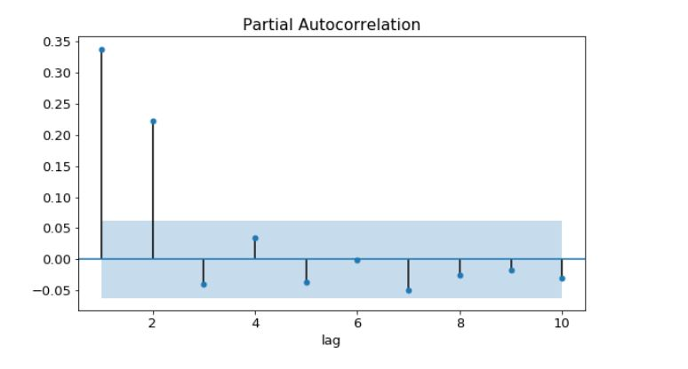
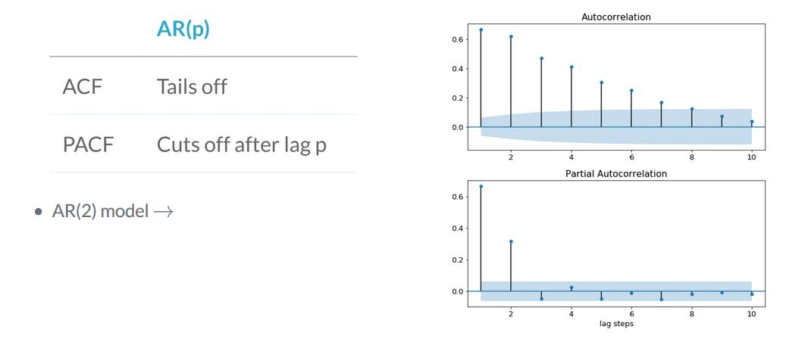
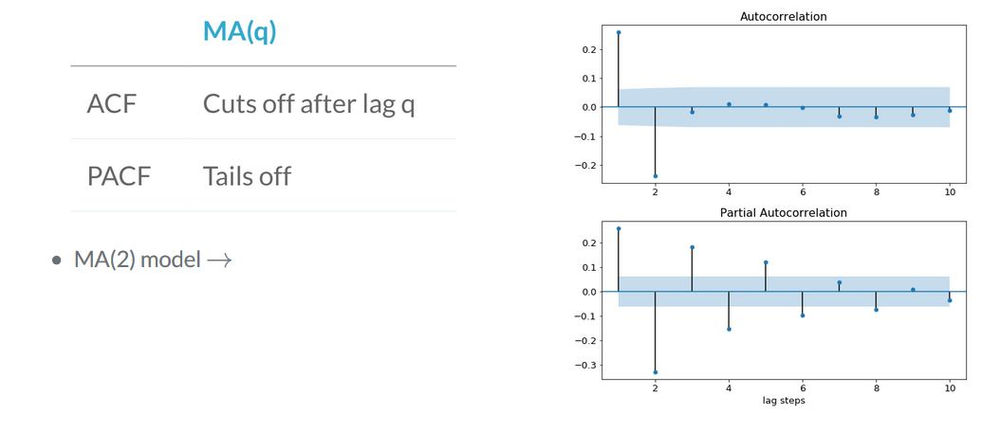
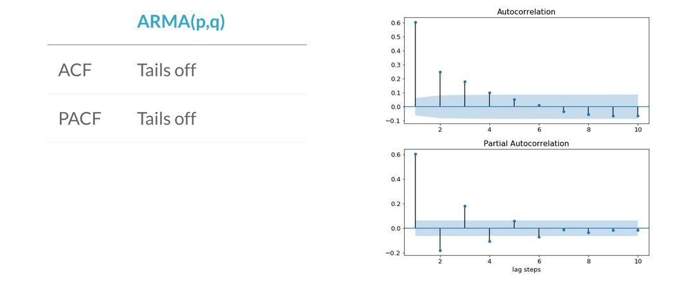
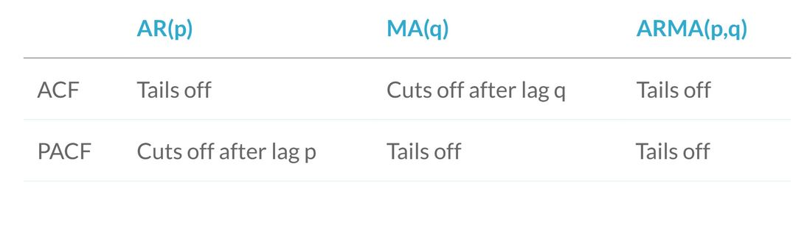
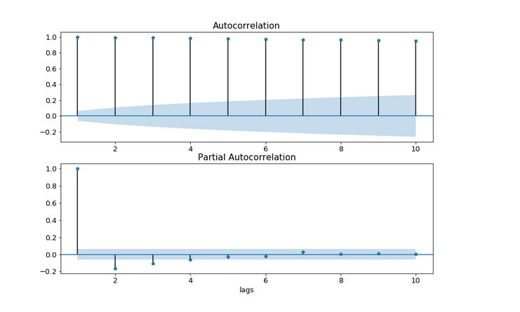
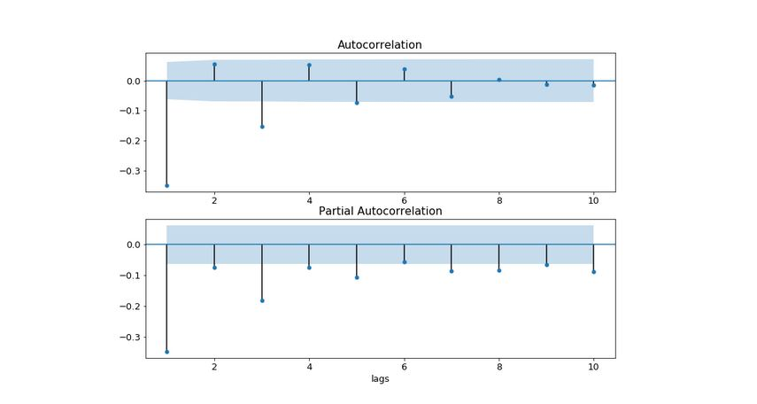

### Making Time-Series stationary

- Previously we plotted the data to check whether it was stationary. But there are also **Statistical tests for stationarity**
- We can also convert a non stationary dataset to stationary.
- The most common test to identify whether a time-series is non-stationary is **augmented Dicky-Fuller test**

#### Augmented Dicky-Fuller test
This is a statistical test with the **null hypothesis** : `Time Series is non stationary due to trend`

#### Applying the adfuller test

```python
from statsmodels.tsa.stattools import adfuller

results = adfuller(df['close'])
```
- The results object is a tuple. The zeroth element is the test statistics. In this case its (-1.34). The more negative this number is, its more likely that the data is stationary.
- 1st element is p-value : (0.60)
If the p-value is <0.05, we reject the null hypothesis and assume that our time-series must be stationary.
- The last item in the results object is the dictionary, this stores the critical values of the test statistics which equates the different p-values.
- In this case if we wanted a p-value of 0.05 or below, **our test statistics needed to be below -2.913**

#### Plotting time series
- It's always worth plotting your time series as well as doing statistical tests.
- These tests are useful, but sometimes they dont capture the full picture.
- Dicky-fuller only tests for trend stationarity.
- Plotting time series can stop you from making wrong assumptions.

### Making a time series stationary
- Suppose a time series is non stationary and we need to transform the data into stationary time series before we can model it.
- We can think of it as feature engineering in Classic Machine Learning.

#### Taking the difference
- A very common way to make a time series stationary is to take its difference.
- `Differece : ^yt = yt - yt-1`
- `df_stationary = df.diff().dropna()`

#### Other transforms
Examples of other transforms
- Take the log : np.log(df)
- Take the sqaure root : np.sqrt(df)
- Take the proportional change: df.shift(1)/df

- Differencing should be the first transform you try to make a time series stationary. But sometimes it is'nt the best option.
A classic way of transforming stock time series is the log-return of the series. This is calculated as follows:

`log_return(yt) = log(yt / yt-1)`

## AR, MA and ARMA models

### AR models - Autoregressive model
In AR models we regress the values of the time-series against previous values of the same time series.

#### AR(1) model : This is the first order AR model, the order of the model is the number of time lags used.
`yt = a1*yt-1 + et`
a1 = Autoregressive coefficent at lag 1.
et = white noise (each shock is random & not related to other shocks in the series)

- Compare this to simple **linear regression**, where yt is the dependent varaible and yt-1 is the independent varaible. Coefficient a1 is just the slope of the line, and the shocks are the residuals of the line.

#### AR(2) model : Order 2 AR model has two autoregressive coefficients and has 2 independent variables

`yt = a1*y(t-1) + a2*y(t-2) + et

#### AR(p) model: In general we use `p` to indicate the order of the model.

`yt = a1*y(t-1) + a2*y(t-2) + ... + ap*y(t-p) + et

## MA models - Moving Average model
In moving average model, we regress the values of the time series against the previous shock values of the same time series.
- MA(1) model: `yt = m1 * e(t-1) + et`
- MA(2) model: `yt = m1 * e(t-1) + m2 * e(t-2) + et
- MA(q) model: `yt = m1 * e(t-1) + m2 * e(t-2) + .... + mq * e(t-q) + et

## ARMA models - Autoregressive moving-average models
- ARMA = AR + MA . ARMA is the combination of the AR and MA models.
- The time series is regressed against previous values and the previous shock terms.

- ARMA(1,1) model:
`yt = a1 * y(t-1) + m1 * e(t-1) + et`

- ARMA(p,q)
- p is the order of AR part
- q is the order of MA part

#### Creating ARMA data
- Using the statsmodel package model, we can both fit ARMA model and generate ARMA data.

## Fitting ARMA models
- When fitting and working with AR, MA and ARMA models it is very important to understand the model order. You will need to pick the model order when fitting. Picking this correctly will give you a better fitting model which makes better predictions.


## Fitting time series models

- Creating a model
```python
from statsmodels.tsa.arima_model import ARMA
model = ARMA(timeseries, order=(p, q))
```

- Fitting an AR model
```python
ar_model = ARMA(timeseries, order=(p, 0))
```

- Fitting an MA model
```python
ma_model = ARMA(timeseries, order=(0, q))
```
```python
model = ARMA(timeseries, order=(2,1))
results = model.fit()
print(results.summary())
```
- The **`std_err`** column in summary tells the uncertainity in the fitted coef values

## Introduction to ARMAX models
- One modification to ARMA models is to use **Exogenous inputs** to create the ARMAX models.
- This means, we model the time series using other independent variables as well.
- This is like a combination between ARMA model and normal Linear Regression model. 
- ARMAX = ARMA + Linear Regression

#### ARMAX equation
- ARMA(1,1) model : yt= a1 * y(t-1) + m1 * e(t-1) + et
- ARMAX(1,1) model : yt = x1 * zt + a1 * y(t-1) + m1 * e(t-1) + et
- Only difference is one additonal term zt and it's coef x1

####e.g where ARMAX is useful. Imagine we need to model our own daily productivity. 
- This can be an ARMA model as productivity on previous day may have affect on productivity today, you could be overworked or on a row.
- A useful **Exogenous variable** could be the amount of sleep you have got the night before, since this might affect your productivity.
- Here **`z1`** would be the hours slept.
- And if more sleep makes you productive, coef **x1** will be **positive**.

## Fitting ARMAX
We can fit an ARMAX model using the same ARMA model class, the only difference is we now feed in the **exogenous variable using the `exog` keyword**

```python
model = ARMA(df['productivity'], order=(2,1), exog=df(['hours_sleep']))
```

# Forecasting
Predicting the next value
- Take AR(1) model : At any point in the time series we can make predictions using the formula `yt = a1 * y(t-1) + et`
- Predict next value
yt = 0.6 * 10 + et
yt = 6.0 + et
- If the shock term has std-deviation of 1, we would predict the uncertainty limit on prediction as: `5.0 < yt < 7.0`

### One-step-ahead predictions
- We can do lot of predictions in-sample using the previous series value to estimate the next one, this is called one-step-ahead predictions.This allows us to evaluate how good our model is in predicting a value one step ahead.
- Uncertainity is due to the random shock terms that we can't predict.

### Statsmodel SARIMAX class

```python
from statsmodels.tsa.statespace.sarimax import SARIMAX

# just an ARMA(p, q) model
model = SARIMAX(df, order=(p, 0, q))
```
- A SARIMAX model with order(p, 0, q) is same as ARMA(p, q). We can also add a constant to a model using `trend = 'c'`. If a time-series is'nt centered around zero, this is a must.

```python
# An ARMA(p, q) + constant model
model = SARIMAX(df, order=(p, 0, q), trend = 'c')
```

#### Making one-step-ahead predictions

```python
# make prediction for last 25 values
results = model.fit()

# make in-sample prediction
forecast = results.get_prediction(start=-25)
```

- We can use `get_prediction` method to make insample predictions.`start = -25` tells how many steps back to begin the forecast.`start=-25` means make predictions for last 25 entries of the training data.
- The centre value of the forecast is stored in `predicted_mean` attribute of the forecast object. This predicted mean is a pandas series

```python
# forecast mean
mean_forecast = forecast.predicted_mean
```

#### Confidence intervals
- To get the lower and the upper limits on the values of our prediction we use the `conf_int` method of the forecast object

```python
# get confidence intervals of forecast
confidence_intervals = forecast.conf_int()
```

#### Plotting predictions
- We can use pyplot plot method to plot the mean values
- We use pyplot `fill_between` to shade the area between lower and upper limits.

```python
plt.figure()

# plot prediction
plt.plot(dates, mean_forecast.values, color='red', label='forecast')

# shade uncertainty area
plt.fill_between(dates, lower_limits, upper_limits, color='pink')
plt.show()
```

### Dynamic predictions
We can make dynamic predictions then just one step ahead.

```python
results = model.fit()
forecast = results.get_prediction(start=-25, dynamic=True)
```

### Forecasting out of sample
- Finally after testing our predictions in sample, we can use our model to predict the future.
- To get **future forecast** we use the **`get_forecast`** method. We use the **`steps`** parameter with number of steps after end of the training data to forecast upto.

```python
forecast = results.get_forecast(steps=20)
```

## Introduction to ARIMA models
- We have learnt that we cannot apply **ARMA** model to non-stationary data, we need to take the difference of the time-series to make it stationary only then we can model it.
- However, when we do this (difference) then we will have a model that will predict difference of the time series. What we really want to predict is not the difference but the actual value of the time-series. 
- We can acheive this by carefully transforming our prediction of the differences.

### Reconstructing original time series after differencing
- The opposite of taking the difference is taking the sum or integral.
- We will have to use this transform to go from prediction of differenced values to prediction of absolute values.
- We can do this transform using the `np.cumsum` function.

```python
diff_forecast = results.get_forecast(steps=10).predicted_mean
from numpy import cumsum
mean_forecast = cumsum(diff_forecast) + df.iloc[-1, 0]
```
- After applying this transform we now have a prediction of how much a time-series changed from its initial value over the forecast peroid.
- To get the absolute value we need to add the last value of the original time series to it. We now have a forecast of the non stationary time-series.

- Take the difference
- Fit ARIMA model
- Integrate forecast
- Can we avoid doing so much work ? Yes!

## ARIMA - Autoregressive Integrated Moving Average

- We can implement ARIMA using the SARIMAX model class from statsmodel

```python
from statsmodels.tsa.statespace.sarimax import SARIMAX
model = SARIMAX(df, order = (p,d,q))
```

- The ARIMA model has 3 model orders
1) p - number of autoregressive lags
2) d - order of differencing
3) q - number of moving average lags

- In ARMA model we were setting the order d to zero. In ARIMA we pass non - differenced time-series and the model order.

```python
model = SARIMAX(df, order=(2, 1, 1))
```
- Here we difference the time series data just once and then apply an ARMA (2, 1) model
- After we have stated the difference parameter we dont need to worry about differencing anymore.
- The differencing and integration steps are all taken care off by the model object.

```python
# Fit model
model.fit()

# Make forecast
mean_forecast = results.get_forecast(steps=steps).predicted_mean
```

### Picking the difference order
- We should be careful in selecting the correct amount of differencing. We difference the data only till its stationary and no more.
- We will decide the differening order using the Augmented Dicky Fuller test

## ACF and PACF
- We know to fit **ARIMA** models. But how do we know which ARIMA model to fit. The model order is very important.
- One correct way to find the order of the model is to use **ACF - Autocorrelation function** and the **PACF - Partial autocorrelation function**
- The **autocorrelation function** at **lag-1** is the correlation between the timeseries and same time series offset by one step.
**lag-1 autocorrelation** -> **corr(yt, y(t-1))**
- The autocorrelation at **lag-2** is the correlation between the timeseries and same time series offset by two steps.

### ACF
- We can plot the autocorrelation function to get the overview of the data.
<p align="center">
  
</p>
- Bars shows that ACF values are increasing lags.If the bars are small and lie in the blue shade region, then they are not statisctically significant.

### PACF
- Partial autocorrelation is the corelation between a time series and the lagged version of itself after we subtract the correlation at smaller lags.So it's the correlation associated with just that particular lag.
<p align="center">
  
</p>
- PACF is these series of values.

## Using the ACF and PACF to choose model order

### AR model
- By comparing the ACF and PACF for time-series we can deduce the model order.If the amplitude of the ACF tails off with increasing lag and the PACF cuts off after some lag p, then we have an **AR(p) model**
- Below plot is an **AR(2) model**
<p align="center">
  
</p>

### MA model
- If the amplitutde of ACF cuts off after some lag q and the amplitude of PACF tails off then we have a **MA(q) model**
- Below is an **MA(2) model**
<p align="center">
  
</p>


### ARMA model
- If both the ACF and PACF tails off then we have an **ARMA model**. In this case, we can't deduce the model orders p & q from the plot.

<p align="center">
  
</p>

- Refer following table when analyzing ACF and PACF

<p align="center">
  
</p>


### Implementation in Python
```python
from statsmodels.graphics.tsaplots import plot_acf, plot_pacf

# create figure
fig, (ax1, ax2) = plt.subplots(2, 1, figsize=(8,8))

# make acf plot
# in each plot we pass the time-series dataframe and the max no of lags we would like to see. We also tell if we want to show autocorrelation at lag 0
# the ACF and PACF at lag=0 always has a value of 1, so we set it to False
plot_acf(df, lags=10, zero=False, ax=ax1)

# make pacf plot
plot_pacf(df, lags=10, zero=False, ax=ax2)
plt.show()
```

## Over/under differencing ACF and PACF
- The time-series must be made stationary before making this plot
- If the ACF value is high and tail off very slowly, this is the sign that the data is non-stationary.So it needs to be differenced.

<p align="center">
  
</p>

- If the autocorrelation at lag-1 is very negative, this is the sign that we have taken the difference too many times.
<p align="center">
  
</p>


