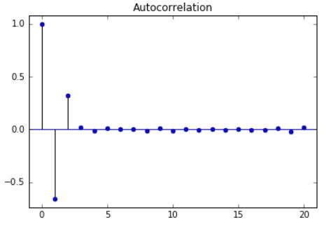
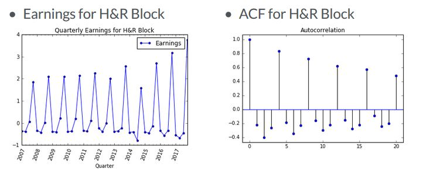
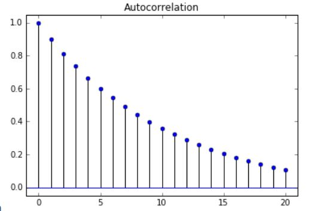

# Time Series Analysis

### Some useful Pandas Tools
- Changing an index to datetime
`df.index = pd.to_datetime(df.index)`

- Plotting data
`df.plot()`

- Join two DataFrames
`df1.join(df2)`

- Often, we will want to convert prices to returns, which we can do with the `pct_change` method. Or if we want differences we can use the `diff` method.

```python
df['col'].pct_change()
df['col'].diff()
```

- We can compute the correlation of two series using the `corr` method and the autocorrelation using the `autocorr` method.
`df['ABC'].corr(df['XYZ'])`

### Correlation of Two Time Series
- A scatter plot helps to visualize the relationship between two time series. The **correlation coefficient** is the measure of how much two series vary together.
- A correlation of 1 means that the two series have a perfect linear relationship with no deviations. High correlations means that the two series strongly vary together. A low correlation means that they vary together but there is a weak association.
- And a high negative correlation means they vary in opposite directions, but still with a linear relationship.

#### Common mistake : Correlation of Two trending Series
- Consider two time series that are both trending. Even if the two series are totally unrelated, we could still get a very high correlation. That's why, when we look at the correlation of two stocks, we should look at the correlation of their **returns** not their levels.

#### Example : Correlation of Large Cap and Small Cap stocks
- Computing the correlation of two financial time series, the S&P500 index of large cap stocks and the Russell 2000 index of small cap stocks, using pandas correlation method.

1. First compute the percentage changes of both series. This gives the **returns of the series instead of prices**

```python
df['SPX_Ret'] = df['SPX_Prices'].pct_change()
df['R2000_Ret'] = df['R2000_Prices'].pct_changes()
```

2. Visualize the correlation using the scatter plot

```python
plt.scatter(df['SPX_Ret'], df['R2000_Ret'])
plt.show()
```

3. Use pandas correlation method for series

```python
correlation = df['SPX_Ret'].corr(df['R2000_Ret'])
print('Correlation is :", correlation)
```

### Simple Linear Regressions
- A simple linear regression finds the slope beta and intercept alpha of a line that's a best fit between a dependent variable y and an independent variable x.
- The x's and y's can be two time series. A LR is also known as Ordinary Least squares or OLS, because it minimizes the sum of the squared distances between the data points and the regression line.

#### Python packages to perform regression
- Regression techniques are very common and therefore, there are many packages in python that can be used.
- In statsmodels

```python
import statsmodels.api as sm
sm.OLS(y, x).fit()
```

- In numpy

```python
np.polyfit(x, y, deg=1) # if deg=1, it fits to data to a line which is LR
```

- In pandas

```python
pd.ols(y,x)
```

- In scipy

```python
from scipy import stats
stats.linregress(x, y)
```

#### Example : Regression of Small Cap Returns on Large Cap
- Regress the returns of the small cap stocks on the returns of large cap stocks.
- We need to add a column of ones as a dependent, right hand side variable. The reason we have to do this is bcz the regression function assumes that if there is no constant column, then we want to run the regression without an intercept.
- **By adding a column of ones, statsmodels will compute the regression coefficeint of that column as well, which can be interpreted as the intercept of the line.**
- The statsmodels method **add_constant** is a simple way to add a constant.

```python
import statsmodels.api as sm

# as before, compute percentage changes in both series
df['SPX_ret'] = df['SPX_Prices'].pct_change()
df['R2000_Ret'] = df['R2000_Prices'].pct_change()

# add a constant to the dataframe for the regression intercept
df = sm.add_constant(df)

# Delete the rows of NaN
df = df.dropna()

# run the regression
results = sm.OLS(df['R2000_Ret'], df[['const', 'SPX_Ret']]).fit()
print(results.summary())
```

- The first argument of the statsmodel regression is the series that represents the 
**dependent variable y** , and the next argument contains the **independent variable** or variables.
- In this case, **the dependent variable is the R2000 returns and the independent variables are the constant and SPX returns**. The **method "fit" runs the regression** and results are saved in a class instance called results.
- The summary method of results shows the entire regression output. The **coef 1.1412 is the slope of the regression**, which is also referred to as beta. The **coef above that is the intercept**, which is very close to zero.
- Intercept : results.params[0], slope : results.params[1]
- Another stats is the R squared of 0.753.

#### Relationship between R-squared and Correlation
- From the scatter diagrams, we saw that the correlation measures how closely the data are clustered along a line. The **R-Squared** also measures **how well the linear regression line fits the data**.
- So as we would expect, there is a relationship between correlation and R-squared.
- The magnitude of the correlation is the square root of the R-squared. **[corr(x,y)]^2 = R^2 (or R-squared)**.
- The **sign of the correlation is the sign of the slope of the regression line**. **sign(corr) = sign(regression slope)**
- If the regression line is positively sloped, the correlation is positive and if the regression line is negatively sloped, the correlation is negative.

### Autocorrelation
- So far,we have looked at the correlation of two time series. Autocorrelation is the correlation of a single time series with a lagged copy of itself. It's also called "serial correlation".
- Often, when we refer to a series's autocorrelation, we mean the "lag-one" autocorrelation. So when using daily data, for e.g, the autocorrelation would be the correlation of the series with the same series lagged by one day.

#### Interpretation of autocorrelation
- What does it mean when a series has a positive or negative autocorrelation? With financial time series, when returns have a negative autocorrelation, we say it is "mean reverting". Alternatively, if a series has a +ve autocorrelation, we say it is "trend-following".

#### Traders Use Autocorrelation to Make Money
- Many hedge fund strategies are only slightly more complex versions of mean reversion and momentum strategies.
- Since stocks have historically has negative autocorrelation over horizons of about a week, one popular strategy is to buy stocks that have dropped over the last week and sell stocks that have gone up.

#### example of positive autiocorrelation : exchange rates
- Example of how we would compute the monthly autocorrelation for the Japanese Yen-US Dollar exchange rate.

```python
# convert index to datetime
df.index = pd.to_datetime(df.index)

# downsample from daily to monthly data
df = df.resample(rule='M', how='last') # rule indicates desired freq :'M' for monthly, how indicates how to do resampling, we can use the first date of the period, the last date or even an average

# compute returns from prices
df['Return'] = df['Price'].pct_change()

# compute autocorrelation
autocorrelation = df['Return'].autocorr()
print("Autocorrelation:", autocorrelation)
```

### Autocorrelation Function, ACF
- The sample autocorrelation function, or ACF, shows not only the lag-one autocorrelation, but the entire autocorrelation function for different lags.
- **Any significant non-zero autocorrelations** implies that the series can be forecast from the past.

#### ACF Example 1: Simple Autocorrelation Function
- This autocorrelation function implies that we can forecast the next value of the series from the last two values, since the lag-one and lag-two autocorrelations differ from zero.



#### ACF Example 2 : Seasonal Earnings



- Consider the time series of quarterly earnings of the company H&R Block. A vast majority of earnings occurs in the quarter that taxes are due.In this case, we can clearly see a seasonal pattern in the quartely data on the left, and the autocorrelation function on the right shows strong autocorrelation at lags 4, 8, 12, 16 and 20.

#### ACF Example 3: Useful for Model Selection



- **Model selection** : The ACF can also be useful for selecting a parsimonious model for fitting the data. In this example, the pattern of autocorrelation suggests a model for the series.

#### Plot ACF in Python
- `plot_acf` is the statsmodels function for plotting the autocorrelation function.
- The input x is a series or array. The argument **lags** indicates how many lags of the autocorrelation function will be plotted. The **alpha argument sets the width of the confidence interval**.

```python
from statsmodels.graphics.tsaplots import plot_acf

# plot the acf
plot_acf(x, lags=20, aplha=0.05)
```

#### Confidence Interval of ACF
- Argument `alpha` sets the width of confidence interval. For e.g if alpha=0.05, that means that if the true autocorrelation at that lag is zero, there is only a 5% chance the sample autocorrelation will fall outside that window.
- We will get a wider confidence interval if we set alpha lower, or if we have fewer observations. If we don't want to see confidence intervals in our plot, set alpha = 1.

#### ACF values instead of Plot
- Besides plotting the ACF, we can also extract its numerical values using a similar Python function, `acf`, instead of plot_acf.

```python
from statsmodels.tsa.stattools import acf
print(acf(x))
```

### White Noise
- White Noise is a series with : **constant mean, constant variance, zero autocorrelations at all lags**
- There are several special cases of white noise: If the data is white noise but also has a normal or Gaussian distribution, then it is called Gaussian White Noise.

#### Simulating white noise
- Its very easy to generate white noise. 

```python
import numpy as np
noise = np.random.normal(loc=0, scale=1, size=500) # loc=mean, scale=std-dev

plt.plot(noise)
```

#### Autocorrelation of White Noise
- All the autocorrelations of a white noise series are zero.

```python
plot_acf(noise, lags=50)
```

#### Stock Market Returns : Close to White Noise
- Autocorrelation Function for the S&P500. There are no lags where the autocorrelation is significantly different from zero.

### Random Walk
- In a random walk, todays price = yesterdays price + some noise. (pt = pt-1 + $t)
- THe change in price of a random walk is just white noise. Incidentally, if prices are in logs, then the difference in log prices is one way to measure returns.
- The bottom line is that if stock prices follow a random walk, then stock returns are White Noise.
- **We can't forecast a random walk**. The best guess for tmrw's price is simply tdy's price.
- In a random walk with drift, prices on average drift by `mu` every period.And the change in price for a random walk with drift is still white noise but with a mean of mu.

#### Statistical Test for Random Walk
- To test whether a series like stock prices follows a random walk, we can regress current prices on lagged prices. **If the slope coefficent beta, is not significantly different from one**, then we cannot reject the null hypothesis that the series is a random walk.
- However, if the slope coefficient is significantly less than one, then we can reject the null hypothesis that the series is a random walk. 
- An identical way to do that test is to regress the difference in prices on the lagged price, and instead of testing whether the slope coefficent is 1, now we test whether it is zero. This is called the **Dickey-Fuller** test.
- If we add more lagged prices on the right hand side, then it's called the **Augmented Dickey-Fuller test.**

#### ADF Test in Python
- statsmodels has a function, adfuller, for performing the Augmented Dickey-Fuller Test.

```python
from statsmodels.tsa.stattools import adfuller

# run augmented dickey test
adfuller(x)
```

#### Example : IS the S&P500 a Random Walk?
- The main output we're interested in is the **p-value of the test**.
- If the p-value is less than 5%, we can reject the null hypothesis that the series is a random walk with 95% confidence.
- In this case, the p-value is much higher than 0.5, its 0.78. Hence, we cannot reject the null hypothesis that S&P500 is a random walk.

```python
# run augmented dickey-fuller test on spx data
results = adfuller(df['SPX'])

# print p-value
print(results[1])

# print full results
print(results)
```

### Stationarity
- **Strong stationarity** : entire distribution of data is time-invariant. It means that the joint distribution of the observations do not depend on time.
- **Weak stationarity** : Mean, variance and autocorrelation are time-invariant (i.e for autocorrelation, corr(Xt, Xt-T) is only a function of T). A less restrictive version of stationarity, and one that is easier to test. Mean, variance and autocorrelations of the oberservations do not depend on time.
- For autocorrelation, the correlation between X-t and X-(t-tau) is only a function of the lag tau, and not a function of time.

#### Why do we care for stationary
- If a process is not stationary, then it becomes difficult to model. 
- Modeling involves estimating a set of parameters, and if a process is not stationary, and the parameters are different at each point in time, then there are too many parameters to estimate. We may end up having more parameters than actual data.If parameters vary with time, too many parameters to estimate.
- So stationarity is necessary for a parsimonious model, one with a smaller set of parameters to estimate. Can only estimate a parsimonious model with a few parameters.

#### Examples of Nonstationary series
- A random walk is a common type of non-stationary series. The variance grows with time. For e.g, if stock prices are a random walk, then the uncertainty about prices tomorrow is much less than the uncertainty 10 years from now.
- Seasonal series are also non-stationary.

#### Transforming Non stationary Series into Stationary Series
- Many non-stationary series can be made stationary through a simple transformation. A random-walk is a non-stationary series, but if we take the first differences, the new series is White Noise, which is stationary.

```python
# random walk
plot.plot(SPY)

# first difference
plot.plot(SPY.diff())
```

- Quarterly earnings for H&R Block, which has a large seasonal component and is therefore not stationary. If we take the `seasonal difference`, by taking the difference with lag of 4, the transformed series looks stationary.

```python
plot.plot(HRB.diff(4))
```

- Sometimes we many need to do 2 transformations. If we see amazon quarterly revenues, its growing exponentially as well as exhibiting a string seasonal pattern.
- First, if we take only the log of the series, we can eliminate the exponential growth.
- But if we take both the log of the series and then the seasonal difference, the transformed series looks stationary.

```python
# log of AMZN Revenues
plt.plot(np.log(AMZN))

# log, then seasonal difference
plt.plot(np.log(AMZN).diff(4))
```

- Many time series exhibit strong seasonal behavior. The procedure for removing the seasonal component of a time series is called seasonal adjustment. 
- For example, most economic data published by the government is seasonally adjusted.
- by taking first differences of a random walk, we get a stationary white noise process. For seasonal adjustments, instead of taking first differences, we can take differences with a lag corresponding to the periodicity.

### AR Model - Autoregressive model

#### Mathematical Description of AR(1) Model
- `Rt = mean + phi Rt-1 + noise` , Today's value equals a mean plus a fraction phi of yesterday's value, plus noise. Since there is only one lagged value on the RHS, this is called an AR model of order 1, or simply an AR(1) model.
- If the AR parameter, phi is one, then the process is a random walk. If phi is zero the process is a white noise.**In order for the process to be stable and stationary, phi has to be between -1 to +1.**

#### Interpretation of AR(1) Parameter
- As an example, suppose Rt is a time series of stock returns. If phi is negative, then a positive return last period, at time t-1, implies that this period's return is more likely to be negative. This is reffered to as mean reversion.
- If phi is positive, then a positive return last period implies that this period's return is expected to be positive.
- Negative phi : **Mean Reversion** , Positive phi: **Momentum**

#### Higher order AR models
- AR(1) = mean + phi * Rt-1 + noise
- AR(2) = mean + phi1 * Rt-2 + noise
- AR(3) = mean + phi1 Rt-1 + phi2 Rt-2 + phi3 * Rt-3 + noise
- The models can be extended to include more lagged values and more phi parameters.

#### Simulating an AR Process
- Often, we we want to study and understand a pure AR process, it is useful to work with simulated data. Statsmodels provides modules for simulating AR processes.

```python
from statsmodels.tsa.arima_process import ArmaProcess
ar = np.array([1, -0.9])
ma = np.array([1])
AR_object = ArmaProcess(ar, ma)
simulated_data = AR_object.generate_sample(nsample=1000)
plt.plot(simulated_data)
```

### Estimating and Forecasting an AR model
- Statsmodels has another module for estimating the parameters of a given AR model.

#### Estimating an AR Model

```python
from statsmodels.tsa.arima_model import ARMA
# import ARMA which is a class,and create an instance of that class called mod
# with the arguments being the data that we're trying to fit, and order of the model
mod = ARMA(simulated_data, order=(1,0))
result = mod.fit()
print(result.summary()) # to see the full output check for mean and phi
print(result.params) # to just see the coefficients
```
- The order(1,0) means we're fitting the data to an AR(1) model. An order(2,0) would mean we're fitting the data to an AR(2) model.

#### Forecast an AR model
- To do forecasting, both in sample and out of sample, we still create an instance of the class using ARMA, and we use the fit method.
- Use the method `plot_predict` to do forecasting. **We give it the start and end points for fitting**.
- If the index of the data is a DatetimeIndex object, we can pick dates for the start and end dates.
- The plot also gives confidence intervals around the out-of-sample forecasts. Notice how the confidence interval gets wider the farther out the forecast is.
- The in-sample is a forecast of the next data point using the data up to that point, and the out-of-sample forecasts any number of data points in the future.  

```python
from statsmodels.tsa.arma_model import ARMA
mod = ARMA(simulated_data order=(1,0))
res = mod.fit()
res.plot_predict(start='2016-07-01', end='2017-06-01')
plt.show()
```

### Choosing theRight Model
- In practise, we will ordinarily not be told the order of the model that we're trying to estimate.

#### Identifying the Order of an AR Model
- There are two techniques that can help determine the order of the AR model: The **rtial Autocorrelation Function, and the Information Criteria**.

#### Partial Autocorrelation Function (PACF)
- Partial Autocorrelation Function measures the incremental benefit of adding another lag. Imagine running several regressions, where the regress returns on more and more lagged values.

```python
Rt = phi0,1 + phi1,1 Rt-1 + noise
Rt = phi0,2 + phi1,2 Rt-1 + phi2,2 Rt-2 + noise
Rt = phi0,3 + phi1,3 Rt-1 + phi2,3 Rt-2 + phi3,3 Rt-3 + noise
Rt = phi0,4 + phi1,4 Rt-1 + phi2,4 Rt-2 + phi3,4 Rt-3 + phi4,4 Rt-4 + noise
```

- The coefficeints represent the values of the partial autocorrelation function for different lags.
- For e.g, in the bottom row, the coefficient phi4,4, is the lag-4 value of the Partial Autocorrelation function, and it represents how significant adding 4th lag is when we already have 3 lags.

#### Plot PACF
- `plot_pacf` is the statsmodels function for plotting the partial autocorrelation function.

```python
from statsmodels.graphics.tsaplots import plot_pacf

plot_pacf(x, lags=20, alpha=0.05) # input x is a series of array
```

- Argument lags indicates how many lags of the partial autocorrelation function will be plotted. Alpha argument sets the width of the confidence interval.

#### Information Criteria
- The more parameters in a model, the better the model will fit the data.But this can lead to overfitting of the data.
- **The Information criteria adjusts the goodness-of-fit of a model by imposing a penalty based on the number of parameters used.**
- Two popular adjusted goodness-of-fit measures are called the **Akaike Information Criterion** and the **Bayesian Information Criterion**. **(AIC & BIC)**

#### Getting Information Criteria from statsmodels
- To get the **AIC and BIC statistics**, we follow the same procedure to fit the data to a model.
- In practise, the way to use the information criteria is to fit several models, each with a different number of parameters, and choose the one with lowest Bayesian information criterion.

```python
from statsmodels.tsa.arima_model import ARMA
mod = ARMA(simulated_data, order=(1,0))
result = mod.fit()

result.summary()

result.params

# to get AIC BIC
result.aic
result.bic
```

#### Information Criteria
- Suppose we are given a time series of data, and unknown to us, it was simulated from an AR(3) model.

1. Fit a simulated AR(3) to different AR(p) models
2. Plot BIC when we fit the data to an AR(1) up to an AR(8) model.
3. Choose p with lowest BIC.

### Moving Average Model
- In a moving average, or MA model, today's value equals a mean plus noise, plus a fraction theta of yesterday's noise.

#### Mathematical Description of MA(1) Model
- `Rt = mean + eta(t) + theta eta(t-1)`
- Since there is only one lagged error on the RHS, this is called an MA model of order 1, or simply an MA(1) model.
- If the MA parameter, theta is zero, then the process is white noise. MA models are stationary for all values of theta.

#### Interpretation of MA(1) parameter
- `Rt = mean + eta(t) + theta eta(t-1)`
- Suppose Rt is a time series of stock returns. If theta is negative, then a positive shock last period, represented by epsilon t-1,would have caused last period's return to be positive, but this period's return is more likely to be negative.
- A shock two periods ago would have no effect on today's return - only the shock now and last period.
- Negative theta : One-period Mean Reversion Positive theta: One-period Momentum
- Also the lag-1 autocorrelation turns out not to be theta, but theta over 1 plus theta squared. (One period autocorrelation : theta/(1 + theta^2), not theta

#### Comparison of MA(1) Autocorrelation Functions
- In each case there is a zero autocorrelation for an MA(1) beyond lag-1.
- When theta is positive the lag-1 autocorrelation is positive and when theta is negative, the lag-1 autocorrelation is negative.

#### Higher order MA models
- MA(1) : `Rt = mean + eta(t) - theta1 eta(t-1)`
- MA(2) : `Rt = mean + eta(t) - theta1 eta(t-1) - theta2 eta(t-2)`
- MA(3) : `Rt = mean + eta(t) - theta1 eta(t-1) - theta2 eta(t-2) - theta3 eta(t-3)`

#### Simulating an MA Process

```python
from statsmodels.tsa.arima_process import ArmaProcess
ar = np.array([1])
ma = np.array([1, 0.5])
AR_object = ArmaProcess(ar, ma)
simulated_data = AR_object.generate_sample(nsample=1000)
plt.plot(simulated_data)
```

- For an MA(1), the AR order is just an array containing 1. The MA order is an array containing 1 and the MA(1) parameter theta.
- Unlike with the AR simulation, we don't need to reverse the sign of theta.

### Estimating and Forecasting an MA Model
- Same as estimating an AR model (except order=(0,1)). The order is (0,1) for an MA(1), not (1,0) for an AR(1).

```python
from statsmodels.tsa.arima_model import ARMA
mod = ARMA(simulated_data, order=(0, 1))
result = mod.fit()
```
#### Forecasting an MA Model
- The procedure for forecasting an MA model is the same as that for an AR model, we create instance of an class using ARMA and we use the fit method to estimate the parameters.
- To estimate an MA model, set the order to (0, 1) then use the method `plot_predict()` to do forecasting as we did forecasting an AR model.
- One thing to note with an MA(1) model, unlike an AR model, all forecasts beyond the one-step ahead forecast will be the same.

```python
from statsmodels.tsa.arima_model import ARMA
mod = ARMA(simulated_data, order=(0,1))
res = mod.fit()
res.plot_predict(start="2016-07-01', end='2017-06-01')
plt.show()
```

### ARMA models
- An ARMA model is combination of an AR and MA model.
- `Rt = mean + phi R(t-1) + eta(t) + theta eta(t-1)` : Formula for an ARMA(1,1) model, which has the familiar AR(1) and MA(1) components.

#### Converting between ARMA, AR and MA models
- ARMA models can be converted to pure AR or pure MA models.

### Cointegration Models
- The idea behind cointegration is that even if the prices of two different assests both follow random walks, it is still possible that a linear combination of them is not a random walk.
- If that's true, then even though P & Q are not forecastable because they're random walks, the linear combination is forecastable, and we say that P and Q are cointegrated.

#### Analogy : Dog on a Leash
- Pt = Owner, Qt = Dog. Both series look like a random walk. Difference, or distance between them, looks mean reverting. If dog falls too far behind, it gets pulled forward. If dog gets too far ahead, it gets pulled back.

#### Example : Heating Oil and Natural Gas
- Both Heating Oil prices and Natural Gas prices look like they're random walks. But when we look at the spread or difference between them, the series looks like it's mean reverting.


